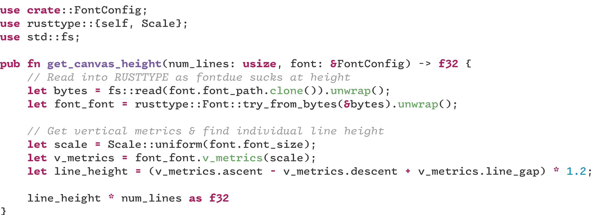

<div align="center">

# sia

</div>

## Summary

**sia** is a command-line tool written in Rust that generates highly customizable preview images of fonts. It can take text input directly or from a file, apply syntax highlighting using various themes, and render it with your chosen font into an image file. This project is a Rust rewrite and evolution of the original Lua-based `fontpeek` tool.

Example!!! ->
[]

## Get Started

Ready to preview your fonts? Jump to the [Installation](#install) section to get started.

## Tutorial

**sia** allows you to generate font previews with a variety of options.

### Basic Usage

The most basic way to use `sia` is to provide a font file and some input text:

```shell
sia --font /path/to/your/font.ttf --input "Hello, world!" --output preview.png
```

This will generate an image `preview.png` showing "Hello, world!" rendered with the specified font.

### Input: Text or File

You can provide the text to be rendered directly on the command line using the `-I` or `--input` option. Alternatively, you can provide a file path, and `sia` will read the content of the file:

```shell
# Input from a file
sia -F YourFont.otf -I ./path/to/your/code.rs -O code_preview.png
```

`sia` will attempt to detect the file type for syntax highlighting based on the extension. If it's not a file, it will try to guess based on the content.

### Customizing the Output

`sia` offers several options to customize the appearance of your font preview:

*   **Output File:**
    *   `-O, --output <PATH>`: Specify the output image file. Defaults to `output.png`.
    *   Environment Variable: `SIA_OUT_FILE`

*   **Font:**
    *   `-F, --font <PATH>`: Path to the font file (required).
    *   Environment Variable: `SIA_FONT`
    *   `--font-size <SIZE>`: Font size in pixels.
    *   Environment Variable: `SIA_FONT_SIZE`

*   **Dimensions:**
    *   `--size <WxH>`: Set the output image dimensions (e.g., `800x600`). If not provided, dimensions are calculated based on content.
    *   Environment Variable: `SIA_DIMENSIONS`

*   **Colors and Alpha:**
    *   `--bg-alpha <ALPHA>`: Background alpha (0.0 to 1.0). Default: `1.0`.
    *   Environment Variable: `SIA_BG_ALPHA`
    *   `--fg-alpha <ALPHA>`: Text/foreground alpha (0.0 to 1.0). Default: `1.0`.
    *   Environment Variable: `SIA_FG_ALPHA`
    *   Colors for syntax highlighting are determined by the theme. The tool supports hex color codes like `#RRGGBB` and `#RRGGBBAA`.

*   **Themes for Syntax Highlighting:**
    *   `-T, --theme <THEME_NAME>`: Specify the syntax highlighting theme. Default: `base16-ocean.dark`.
        `sia` uses `syntect` themes. You can list available themes or explore `syntect` documentation for more.

### Configuration via Environment Variables

All CLI options can also be configured via environment variables. For example, instead of `sia --font /path/to/font.ttf`, you can set `SIA_FONT=/path/to/font.ttf` in your environment.

**Example with more options:**

```shell
export SIA_FONT="MesloLGS NF Regular.ttf"
export SIA_FONT_SIZE="18"
export SIA_DIMENSIONS="1200x800"

sia --input ./src/main.rs \
    --output rust_code_preview.png \
    --theme "Solarized (dark)" \
    --bg-alpha 0.9
```

## Design Philosophy

**sia** aims to be a robust and flexible tool for developers and designers who need to quickly visualize fonts with actual code or text snippets. Key principles include:

*   **Customization:** Provide a comprehensive set of options to control the output, from dimensions and font size to colors and syntax highlighting themes.
*   **Ease of Use:** Offer a straightforward command-line interface with sensible defaults, along with the flexibility of environment variable configuration.
*   **Leveraging Rust:** Utilize the performance and safety of Rust, along with its rich ecosystem of libraries for image processing, font rendering, and syntax highlighting.
*   **Accurate Previews:** Ensure that the generated previews are as close as possible to how the text would appear in a typical code editor or terminal, especially concerning syntax highlighting.

## Building and Debugging

To build **sia** from source:

1.  Ensure you have the Rust toolchain installed.
2.  Clone the repository:
    ```shell
    git clone https://github.com/philocalyst/sia.git 
    cd sia
    ```
3.  Build the project:
    ```shell
    cargo build
    ```
    For a release build:
    ```shell
    cargo build --release
    ```
    The executable will be in `target/debug/sia` or `target/release/sia`.

### Debugging

**sia** uses `env_logger` for logging. To enable debug logs, set the `RUST_LOG` environment variable:

```shell
RUST_LOG=debug cargo run -- -F YourFont.ttf -I "Test"
# Or for an installed binary
RUST_LOG=debug sia -F YourFont.ttf -I "Test"
```

## Install

### From Source

Ensure you have Rust and Cargo installed. You can then install **sia** directly using Cargo:

```shell
cargo install --path .
```

(If you publish to crates.io, you would add `cargo install sia` here.)

### Prerequisites

*   Rust toolchain (for building/installing from source)
*   System fonts (for fallback and general availability if not all fonts are self-contained)

## Changelog

All notable changes to this project are documented in the [CHANGELOG.md](CHANGELOG.md) file.

## Libraries Used

**sia** is built with the help of several fantastic Rust crates:

*   **CLI:** `clap`
*   **Image Processing:** `image`, `imageproc`, `resvg`, `tiny-skia`, `tiny-skia-path`
*   **Font Handling:** `rusttype`, `fontdue`, `usvg` (for SVG font handling)
*   **Syntax Highlighting:** `syntect`
*   **Color Handling:** `rgb`
*   **File & System:** `file-format`, `log`, `env_logger`, `thiserror`, `anyhow`, `lazy_static`
*   **SVG Generation:** `svg` (the crate, for building SVG structures)
*   **XML Parsing (indirectly via dependencies):** `quick-xml`, `roxmltree`

## Acknowledgements

*   This project was inspired by and builds upon concepts from [sdushantha/fontpreview](https://github.com/sdushantha/fontpreview) and [charm/freeze](https://github.com/charmbracelet/freeze).
*   Thanks to the creators and maintainers of all the Rust libraries used in this project.

## License

This project is licensed under the [MIT] - see the `LICENSE.md` file for details.
